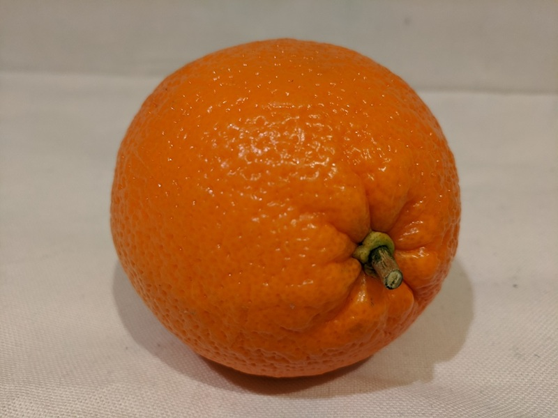

---
lab:
  title: 开发支持视觉的聊天应用
  description: 了解如何使用 Azure AI Foundry 生成支持图像输入的生成式 AI 应用。
---

# 开发支持视觉的聊天应用

在本练习中，你将使用 *Phi-4-multimodal-instruct* 生成式 AI 模型生成对包含图像的提示的响应。 你将开发一款应用，该应用使用 Azure AI Foundry 和 Azure AI 模型推理服务为杂货店中的新鲜农产品提供 AI 帮助。

此练习大约需要 **30** 分钟。

## 创建 Azure AI Foundry 项目

让我们首先创建 Azure AI Foundry 项目。

1. 在 Web 浏览器中打开 [Azure AI Foundry 门户](https://ai.azure.com)，网址为：`https://ai.azure.com`，然后使用 Azure 凭据登录。 关闭首次登录时打开的任何使用技巧或快速入门窗格，如有必要，请使用左上角的 **Azure AI Foundry** 徽标导航到主页，如下图所示：

    

2. 在主页中，选择“**+ 创建项目**”。
3. 在**创建项目**向导中，输入项目的有效名，如果出现建议使用现有中心的提示，请选择新建中心的选项。 然后查看将自动创建的 Azure 资源以支持中心和项目。
4. 选择“**自定义**”并为中心指定以下设置：
    - **中心名称**：*中心的有效名称*
    - **订阅**：Azure 订阅
    - **资源组**：*创建或选择资源组*
    - **位置**：选择以下任一区域\*：
        - 美国东部
        - 美国东部 2
        - 美国中北部
        - 美国中南部
        - 瑞典中部
        - 美国西部
        - 美国西部 3
    - **连接 Azure AI 服务或 Azure OpenAI**：*新建 AI 服务资源*
    - **连接 Azure AI 搜索**：跳过连接

    > \*撰写本文时，我们将在本练习中使用的 *Phi-4-multimodal-instruct* 模型在这些区域中可用。 可以在 [Azure AI Foundry 文档](https://learn.microsoft.com/azure/ai-foundry/how-to/deploy-models-serverless-availability#region-availability)中查看特定模型的最新区域可用性。 如果在稍后的练习中达到区域配额限制，则可能需要在其他区域中创建另一个资源。

5. 选择“**下一步**”查看配置。 然后，选择“**创建**”并等待该进程完成。
6. 创建项目后，关闭显示的所有使用技巧，并查看 Azure AI Foundry 门户中的项目页面，如下图所示：

    

## 部署多模式模型

现在，你已准备好部署支持基于图像的输入的多模式模型。 有多个模型可供选择，包括 OpenAI *GPT-4o* 模型。 在本练习中，我们将使用可支持包含图像的提示的 *Phi-4-multimodal-instruct* 模型。

1. 在 Azure AI Foundry 项目页右上角的工具栏中，使用**预览功能** (**&#9215;**) 图标启用**将模型部署到 Azure AI 模型推理服务**功能。 此功能可确保模型部署可供 Azure AI 推理服务使用，你可在应用程序代码中使用该服务。
2. 在项目左侧窗格的“**我的资产**”部分中，选择“**模型 + 终结点**”页。
3. 在“**模型 + 终结点**”页的“**模型部署**”选项卡中，在“**+ 部署模型**”菜单中，选择“**部署基础模型**”。
4. 在列表中搜索“**Phi-4-multimodal-instruct**”模型，然后选择并确认此模型。
5. 如果出现提示，请同意许可协议，然后在部署详细信息中选择“**自定义**”并使用以下设置部署模型：
    - **部署名**：*有效的模型部署名*
    - **部署类型**：全局标准
    - **部署详细信息**：*使用默认设置*
6. 等待部署预配状态为“**完成**”。

## 在操场中测试模型

部署多模式模型后，即可在聊天操场中使用基于图像的提示对其进行测试。

1. 在左侧导航窗格中，选择“**操场**”页，然后打开“**聊天**”操场。
1. 1. 在新浏览器选项卡中，从`https://github.com/MicrosoftLearning/mslearn-ai-vision/raw/refs/heads/main/Labfiles/08-gen-ai-vision/mango.jpeg`下载 [mango.jpeg](https://github.com/MicrosoftLearning/mslearn-ai-vision/raw/refs/heads/main/Labfiles/08-gen-ai-vision/mango.jpeg) 并将其保存到本地文件系统上的文件夹。
1. 在“聊天操场”页的“**设置**”窗格中，确保已选择“**Phi-4-multimodal-instruct**”模型部署。
1. 在主“聊天会话”面板的“聊天输入”框下，使用附加按钮 (**&#128206;**) 上传 *mango.jpeg* 图像文件，然后添加文本`What desserts could I make with this fruit?`并提交提示。

    

1. 查看响应，希望此举可以为使用芒果制作甜点提供相关指导。

## 创建客户端应用程序

部署模型后，可以在客户端应用程序中使用部署。

> **提示**：可以选择使用 Python 或 Microsoft C# *（即将推出）* 开发解决方案。 按照所选语言的相应部分中的说明进行操作。

### 准备应用程序配置

1. 在 Azure AI Foundry 门户中，查看项目的“**概述**”页。
2. 在“**项目详细信息**”区域中，记下**项目连接字符串**。 你将使用此连接字符串连接到客户端应用程序中的项目。
3. 打开新的浏览器选项卡（使 Azure AI Foundry 门户在现有选项卡中保持打开状态）。 然后在新选项卡中，浏览到 [Azure 门户](https://portal.azure.com)，网址为：`https://portal.azure.com`；如果出现提示，请使用 Azure 凭据登录。

    关闭任何欢迎通知以查看 Azure 门户主页。

1. 使用页面顶部搜索栏右侧的 **[\>_]** 按钮在 Azure 门户中新建 Cloud Shell，选择订阅中不含存储的 ***PowerShell*** 环境。

    在 Azure 门户底部的窗格中，Cloud Shell 提供命令行接口。 可以调整此窗格的大小或最大化此窗格，以便更易于使用。

    > **备注**：如果以前创建了使用 *Bash* 环境的 Cloud Shell，请将其切换到 ***PowerShell***。

5. 在 Cloud Shell 工具栏的“**设置**”菜单中，选择“**转到经典版本**”（这是使用代码编辑器所必需的）。

    **<font color="red">在继续作之前，请确保已切换到 Cloud Shell 的经典版本。</font>**

1. 在 Cloud Shell 窗格中，输入以下命令以克隆包含此练习代码文件的 GitHub 存储库（键入命令，或将其复制到剪贴板后，在命令行中右键单击并粘贴为纯文本）：


    ```
    rm -r mslearn-ai-vision -f
    git clone https://github.com/MicrosoftLearning/mslearn-ai-vision
    ```

    > **提示**：将命令粘贴到 cloudshell 中时，输出可能会占用大量屏幕缓冲区。 可以通过输入 `cls` 命令来清除屏幕，以便更轻松地专注于每项任务。

7. 克隆存储库后，导航到包含应用程序代码文件的文件夹：  

    **Python**

    ```
   cd mslearn-ai-vision/Labfiles/08-gen-ai-vision/python
    ```

    **C#**

    ```
   cd mslearn-ai-vision/Labfiles/08-gen-ai-vision/c-sharp
    ```

8. 在 Cloud Shell 命令行窗格中，输入以下命令安装将使用的库：

    **Python**

    ```
   python -m venv labenv
   ./labenv/bin/Activate.ps1
   pip install python-dotenv azure-identity azure-ai-projects azure-ai-inference
    ```

    **C#**

    ```
   dotnet add package Azure.Identity
   dotnet add package Azure.AI.Inference --version 1.0.0-beta.3
   dotnet add package Azure.AI.Projects --version 1.0.0-beta.3
    ```

9. 输入以下命令以编辑已提供的配置文件：

    **Python**

    ```
   code .env
    ```

    **C#**

    ```
   code appsettings.json
    ```

    该文件已在代码编辑器中打开。

10. 在代码文件中，将 **your_project_connection_string** 占位符替换为项目的连接字符串（从 Azure AI Foundry 门户中的项目“**概述**”页复制），并将 **your_model_deployment** 占位符替换为分配给 Phi-4-multimodal-instruct 模型部署的名称。
11. 替换占位符后，在代码编辑器中使用 “CTRL+S”**** 命令或“ 右键单击 > 保存”**** 保存更改，然后使用 “CTRL+Q”**** 命令或 “右键单击 > 退出”**** 关闭代码编辑器，同时保持 Cloud Shell 命令行打开。

### 写入代码以连接到项目并获取模型的聊天客户端

> **提示**：添加代码时，请务必保持正确的缩进。

1. 输入以下命令以编辑已提供的代码文件：

    **Python**

    ```
   code chat-app.py
    ```

    **C#**

    ```
   code Program.cs
    ```

2. 在代码文件中，请注意在文件顶部添加的现有语句，以导入必要的 SDK 命名空间。 然后，查找注释“**添加引用**”，添加以下代码以引用之前安装的库中的命名空间：

    **Python**

    ```python
   # Add references
   from dotenv import load_dotenv
   from azure.identity import DefaultAzureCredential
   from azure.ai.projects import AIProjectClient
   from azure.ai.inference.models import (
        SystemMessage,
        UserMessage,
        TextContentItem,
        ImageContentItem,
        ImageUrl,
   )
    ```

    **C#**

    ```csharp
   // Add references
   using Azure.Identity;
   using Azure.AI.Projects;
   using Azure.AI.Inference;
    ```

3. 在 **main** 函数的注释“**获取配置设置**”下，请注意，代码将加载配置文件中定义的项目连接字符串和模型部署名称值。
4. 查找注释“**初始化项目客户端**”，添加以下代码，以使用当前登录所使用的 Azure 凭据连接到 Azure AI Foundry 项目：

    **Python**

    ```python
   # Initialize the project client
   project_client = AIProjectClient.from_connection_string(
        conn_str=project_connection,
        credential=DefaultAzureCredential())
    ```

    **C#**

    ```csharp
   // Initialize the project client
   var projectClient = new AIProjectClient(project_connection,
                        new DefaultAzureCredential());
    ```

5. 查找注释“**获取聊天客户端**”，添加以下代码以创建与模型聊天的客户端对象：

    **Python**

    ```python
   # Get a chat client
   chat_client = project_client.inference.get_chat_completions_client(model=model_deployment)
    ```

    **C#**

    ```csharp
   // Get a chat client
   ChatCompletionsClient chat = projectClient.GetChatCompletionsClient();
    ```

### 写入代码以提交基于 URL 的图像提示

1. 请注意，代码包含一个循环，允许用户输入提示，直到输入“退出”。 然后在循环部分，查找注释“**获取对图像输入的响应**”，添加以下代码以提交包含以下图像的提示：

    

    **Python**

    ```python
   # Get a response to image input
   image_url = "https://github.com/MicrosoftLearning/mslearn-ai-vision/raw/refs/heads/main/Labfiles/08-gen-ai-vision/orange.jpeg"
   image_format = "jpeg"
   request = Request(image_url, headers={"User-Agent": "Mozilla/5.0"})
   image_data = base64.b64encode(urlopen(request).read()).decode("utf-8")
   data_url = f"data:image/{image_format};base64,{image_data}"

   response = chat_client.complete(
        messages=[
            SystemMessage(system_message),
            UserMessage(content=[
                TextContentItem(text=prompt),
                ImageContentItem(image_url=ImageUrl(url=data_url))
            ]),
        ]
   )
   print(response.choices[0].message.content)
    ```

    **C#**

    ```csharp
   // Get a response to image input
   string imageUrl = "https://github.com/MicrosoftLearning/mslearn-ai-vision/raw/refs/heads/main/Labfiles/08-gen-ai-vision/orange.jpeg";
   ChatCompletionsOptions requestOptions = new ChatCompletionsOptions()
   {
        Messages = {
           new ChatRequestSystemMessage(system_message),
           new ChatRequestUserMessage([
                new ChatMessageTextContentItem(prompt),
                new ChatMessageImageContentItem(new Uri(imageUrl))
            ]),
        },
        Model = model_deployment
   };
   var response = chat.Complete(requestOptions);
   Console.WriteLine(response.Value.Content);
    ```

2. 使用 **Ctrl+S** 命令保存对代码文件的更改 - 请勿先关闭。

3. 在代码编辑器下方的 Cloud Shell 命令行窗格中，输入以下命令以运行应用：

    **Python**

    ```
   python chat-app.py
    ```

    **C#**

    ```
   dotnet run
    ```

4. 出现提示时，输入以下提示：

    ```
   Suggest some recipes that include this fruit
    ```

5. 查看回应。 然后输入`quit`以退出程序。

### 修改代码以上传本地图像文件

1. 在应用代码的代码编辑器中，在循环部分中，查找之前在注释“**获取对图像输入的响应**”下添加的代码。 然后按如下所示修改代码，以上传此本地图像文件：

    

    **Python**

    ```python
   # Get a response to image input
   script_dir = Path(__file__).parent  # Get the directory of the script
   image_path = script_dir / 'mystery-fruit.jpeg'
   mime_type = "image/jpeg"

    # Read and encode the image file
    with open(image_path, "rb") as image_file:
        base64_encoded_data = base64.b64encode(image_file.read()).decode('utf-8')

    # Include the image file data in the prompt
    data_url = f"data:{mime_type};base64,{base64_encoded_data}"
    response = chat_client.complete(
        messages=[
            SystemMessage(system_message),
            UserMessage(content=[
                TextContentItem(text=prompt),
                ImageContentItem(image_url=ImageUrl(url=data_url))
            ]),
        ]
    )
    print(response.choices[0].message.content)
    ```

    **C#**

    ```csharp
   // Get a response to image input
   string imagePath = "mystery-fruit.jpeg";
   string mimeType = "image/jpeg";
    
   // Read and encode the image file
   byte[] imageBytes = File.ReadAllBytes(imagePath);
   var binaryImage = new BinaryData(imageBytes);
    
   // Include the image file data in the prompt
   ChatCompletionsOptions requestOptions = new ChatCompletionsOptions()
   {
        Messages = {
            new ChatRequestSystemMessage(system_message),
            new ChatRequestUserMessage([
                new ChatMessageTextContentItem(prompt),
                new ChatMessageImageContentItem(bytes: binaryImage, mimeType: mimeType) 
            ]),
        },
        Model = model_deployment
   };
   var response = chat.Complete(requestOptions);
   Console.WriteLine(response.Value.Content);
    ```

2. 使用 **Ctrl+S** 命令保存对代码文件的更改。 还可以根据需要关闭代码编辑器 (**CTRL+Q**)。

3. 在代码编辑器下方的 Cloud Shell 命令行窗格中，输入以下命令以运行应用：

    **Python**

    ```
   python chat-app.py
    ```

    **C#**

    ```
   dotnet run
    ```

4. 出现提示时，输入以下提示：

    ```
   What is this fruit? What recipes could I use it in?
    ```

5. 查看回应。 然后输入`quit`以退出程序。

    > **备注**：在此简单应用中，我们尚未实现用于保留对话历史记录的逻辑；因此模型会将每个提示视为一个新请求，且没有上一提示的上下文。

## 进一步探索：（如果时间允许）

你已了解如何使用 Azure AI 推理 SDK 和多模式模型实现可响应基于图像的提示的生成式 AI 应用。 如果有时间，可对以下想法做进一步探索。

### 使用不同的多模式模型

你已使用 *Phi-4-multimodal-instruct* 模型生成对基于图像的提示的响应。 现在，让我们尝试使用 OpenAI *GPT-4o* 模型。

1. 在 Azure AI Foundry 中，将 **GPT-4o** 模型部署到 Azure AI 模型推理终结点（可能需要在不同的区域中新建资源）。
1. 更新应用的代码配置文件（Python 的 *.env*，C# 的 *appsettings.json*），以指定 GPT-4o 模型的名称。
1. 使用相同的提示像往常一样运行应用（如果需要，可以还原为使用基于 URL 的图像的代码）。

### 使用 OpenAI API

本练习中使用的代码基于 Azure AI 推理 SDK，该 SDK 适用于部署到 Azure AI 模型推理终结点的任何模型。 使用 OpenAI 模型时，也可以使用 OpenAI SDK。

以下说明基于如下假设：你已完成本练习以及上述部署和测试 **GPT-4o** 模型的其他任务。

1. 安装（或更新）应用所需的包：

    **Python**

    ```
   python -m venv labenv
   ./labenv/bin/Activate.ps1
   pip install python-dotenv azure-identity azure-ai-projects openai
    ```
    
    **C#**

    ```
   dotnet add package Azure.Identity
   dotnet add package Azure.AI.Projects --prerelease
   dotnet add package Azure.AI.OpenAI --prerelease
    ```

1. 更新代码文件中的命名空间（移除 *azure.ai-inference* 引用）：

    **Python**

    ```python
   # Add references
   from dotenv import load_dotenv
   from azure.identity import DefaultAzureCredential
   from azure.ai.projects import AIProjectClient
   import openai
    ```

    **C#**

    ```csharp
   // Add references
   using Azure.Identity;
   using Azure.AI.Projects;
   using OpenAI.Chat;
   using Azure.AI.OpenAI;
    ```

1. 修改代码以获取聊天客户端：

    **Python**

    ```python
   # Get a chat client
   chat_client = project_client.inference.get_azure_openai_client(api_version="2024-10-21")
    ```

    **C#**

    ```csharp
   // Get a chat client
   ChatClient chatClient = projectClient.GetAzureOpenAIChatClient(model_deployment);
    ```

1. 修改代码以获取基于本地图像文件的补全

    **Python**

    ```python
   # Get a response to image input
   script_dir = Path(__file__).parent  # Get the directory of the script
   image_path = script_dir / 'mystery-fruit.jpeg'
   mime_type = "image/jpeg"

   # Read and encode the image file
   with open(image_path, "rb") as image_file:
        base64_encoded_data = base64.b64encode(image_file.read()).decode('utf-8')

   # Include the image file data in the prompt
   data_url = f"data:{mime_type};base64,{base64_encoded_data}"
   response = chat_client.chat.completions.create(
        model=model_deployment,
        messages=[
            { "role": "system", "content": system_message },
            { "role": "user", "content": [  
                { 
                    "type": "text", 
                    "text": prompt 
                },
                { 
                    "type": "image_url",
                    "image_url": {
                        "url": data_url
                    }
                }
            ] } 
        ]
   )
   completion = response.choices[0].message.content
   print(completion)
    ```

    **C#**

    ```csharp
   // Get a response to image input
   string imagePath = "mystery-fruit.jpeg";
   string mimeType = "image/jpeg";
    
   // Read and encode the image file
   byte[] imageBytes = File.ReadAllBytes(imagePath);
   var binaryImage = new BinaryData(imageBytes);

   // Include the image file data in the prompt
   List<ChatMessage> messages =
   [
        new SystemChatMessage(system_message),
        new UserChatMessage(
            ChatMessageContentPart.CreateTextPart(prompt),
            ChatMessageContentPart.CreateImagePart(binaryImage, mimeType)),
   ];

   ChatCompletion completion = chatClient.CompleteChat(messages);
   Console.WriteLine(completion.Content[0].Text);
    ```

1. 保存更改并运行应用，以使用之前使用的相同提示对其进行测试。

## 清理

如果已完成对 Azure AI Foundry 的探索，则应删除在本练习中创建的资源，以避免产生不必要的 Azure 成本。

1. 返回到包含 Azure 门户的浏览器选项卡（或在新的浏览器选项卡中重新打开 [Azure 门户](https://portal.azure.com)，网址为：`https://portal.azure.com`），查看已在其中部署本练习中使用的资源的资源组内容。
1. 在工具栏中，选择“删除资源组”****。
1. 输入资源组名称，并确认要删除该资源组。
