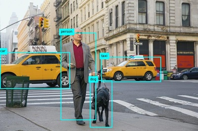

---
lab:
  title: 分析图像
  description: 使用 Azure AI 视觉图像分析来分析图像、建议描述文字和标记，以及检测物体和人员。
---

# 分析图像

Azure AI 视觉是一种人工智能功能，可支持软件系统通过分析图像来解释视觉输入。 在 Microsoft Azure 中，**视觉** Azure AI 服务为常见的计算机视觉任务提供预建模型，包括分析图像以建议标题和标签、检测常见物体和人物。 您还可以使用 Azure AI 视觉服务移除背景或创建图像的前景垫层。

> **注意**：本练习基于预发布版 SDK 软件，未来可能会有所变动。 必要时，我们使用了特定版本的包；这可能没有反映最新的可用版本。 可能会遇到一些意想不到的行为、警告或错误。

尽管本练习基于 Azure 视觉 Python SDK，但你也可以使用多种语言特定的 SDK 开发视觉应用程序，包括：

* [适用于 JavaScript 的 Azure AI 视觉分析](https://www.npmjs.com/package/@azure-rest/ai-vision-image-analysis)
* [适用于 Microsoft .NET 的 Azure AI 视觉分析](https://www.nuget.org/packages/Azure.AI.Vision.ImageAnalysis)
* [适用于 Java 的 Azure AI 视觉分析](https://mvnrepository.com/artifact/com.azure/azure-ai-vision-imageanalysis)

此练习大约需要 **30** 分钟。

## 预配 Azure AI 视觉资源

如果订阅中还没有 Azure AI 视觉资源，则需要进行预配。

> **注意**：在本练习中，你将使用独立的“计算机视觉”**** 资源。 还可以直接使用 Azure AI 服务多服务资源中的 Azure AI 视觉服务，或在 Azure AI Foundry 项目中使用。****

1. 打开 [Azure 门户](https://portal.azure.com) (网址为 `https://portal.azure.com`)，然后使用你的 Azure 凭据登录。 关闭显示的任何欢迎消息或提示。
1. 选择“创建资源”。****
1. 在搜索栏中，搜索 `Computer Vision`，选择“计算机视觉”，然后使用以下设置创建资源：****
    - **订阅**：Azure 订阅
    - **资源组**：*创建或选择资源组*
    - 区域****：从以下区域进行选择：美国东部、美国西部、法国中部、韩国中部、北欧、东南亚、西欧或东亚*********************************\**
    - **名称**：计算机视觉资源的有效名称**
    - **定价层**：免费 F0

    \*Azure AI 视觉 4.0 完整功能集目前仅在这些区域提供。

1. 选中所需的复选框并创建资源。
1. 等待部署完成，然后查看部署详细信息。
1. 部署资源后，转到该资源，然后在导航窗格中的“资源管理”节点下查看其“密钥和终结点”页面。******** 你将在下一个过程中用到此页面中的终结点和其中一个密钥。

## 使用 Azure AI 视觉 SDK 开发图像分析应用

在此练习中，你将完成一个已部分实现的客户端应用程序，该应用程序使用计算机视觉 SDK 来分析图像。

### 准备应用程序配置

1. 在 Azure 门户中，使用页面顶部搜索栏右侧的“[\>_]”按钮在 Azure 门户中创建新的 Cloud Shell，选择订阅中不含存储的“PowerShell”环境。**********

    在 Azure 门户底部的窗格中，Cloud Shell 提供命令行接口。

    > **备注**：如果以前创建了使用 *Bash* 环境的 Cloud Shell，请将其切换到 ***PowerShell***。

    > **注意**：如果门户要求你选择存储来保存文件，请选择“不需要存储帐户”，选择正在使用的订阅，然后按“应用”。********

1. 在 Cloud Shell 工具栏的“**设置**”菜单中，选择“**转到经典版本**”（这是使用代码编辑器所必需的）。

    **<font color="red">在继续作之前，请确保已切换到 Cloud Shell 的经典版本。</font>**

1. 重设 Cloud Shell 窗格的大小，以便你仍然可以看到计算机视觉资源的“密钥和终结点”页面。****

    > 提示****：可以通过拖动上边框来调整窗格的大小。 还可以使用最小化和最大化按钮在 Cloud Shell 和主门户界面之间切换。

1. 在 Cloud Shell 窗格中，输入以下命令以克隆包含此练习代码文件的 GitHub 存储库（键入命令，或将其复制到剪贴板后，在命令行中右键单击并粘贴为纯文本）：

    ```
    rm -r mslearn-ai-vision -f
    git clone https://github.com/MicrosoftLearning/mslearn-ai-vision
    ```

    > **提示**：将命令粘贴到 Cloudshell 中时，输出可能会占用大量屏幕缓冲区。 可以通过输入 `cls` 命令来清除屏幕，以便更轻松地专注于每项任务。

1. 克隆存储库后，使用以下命令导航到并查看包含应用程序代码文件的文件夹：   

    ```
   cd mslearn-ai-vision/Labfiles/analyze-images/python/image-analysis
   ls -a -l
    ```

    该文件夹包含应用的应用程序配置和代码文件。 它还包含 /images**** 子文件夹，其中包含应用将分析的某些图像文件。
    
1. 运行以下命令安装 Azure AI 视觉 SDK 包和其他所需包：

    ```
   python -m venv labenv
   ./labenv/bin/Activate.ps1
   pip install -r requirements.txt azure-ai-vision-imageanalysis==1.0.0
    ```

1. 输入以下命令来编辑应用的配置文件：

    ```
   code .env
    ```

    该文件已在代码编辑器中打开。

1. 在代码文件中，更新它所包含的配置值以反映计算机视觉资源的终结点和身份验证密钥（从Azure 门户的“密钥和终结点”页面复制）。************
1. 替换占位符后，使用 **Ctrl+S** 命令保存更改，然后使用 **Ctrl+Q** 命令关闭代码编辑器，同时使 Cloud Shell 命令行保持打开状态。

### 添加代码以建议描述文字

1. 在 Cloud Shell 命令行中，输入以下命令以打开客户端应用程序的代码文件：

    ```
   code image-analysis.py
    ```

    > **提示**：你可能希望最大化 Cloud Shell 窗格并在命令行控制台和代码编辑器之间移动拆分栏，以便更轻松地查看代码。

1. 在代码文件中，找到注释“导入命名空间”****，并添加以下代码以导入使用 Azure AI 视觉 SDK 所需的命名空间：

    ```python
   # import namespaces
   from azure.ai.vision.imageanalysis import ImageAnalysisClient
   from azure.ai.vision.imageanalysis.models import VisualFeatures
   from azure.core.credentials import AzureKeyCredential
    ```

1. 请注意，在 Main**** 函数中，已提供用于加载配置设置和确定要分析的图像文件的代码。 然后找到注释“对 Azure AI 视觉客户端进行身份验证”，并添加以下代码以创建和验证 Azure AI 视觉客户端物体（确保保持正确的缩进级别）：****

    ```python
   # Authenticate Azure AI Vision client
   cv_client = ImageAnalysisClient(
        endpoint=ai_endpoint,
        credential=AzureKeyCredential(ai_key))
    ```

1. 在 Main 函数中刚刚添加的代码下，查找注释“分析图像”并添加以下代码：********

    ```python
   # Analyze image
   with open(image_file, "rb") as f:
        image_data = f.read()
   print(f'\nAnalyzing {image_file}\n')

   result = cv_client.analyze(
        image_data=image_data,
        visual_features=[
            VisualFeatures.CAPTION,
            VisualFeatures.DENSE_CAPTIONS,
            VisualFeatures.TAGS,
            VisualFeatures.OBJECTS,
            VisualFeatures.PEOPLE],
   )
    ```

1. 查找注释“获取图像描述文字”，添加以下代码以显示图像描述文字和密集描述文字：****

    ```python
   # Get image captions
   if result.caption is not None:
        print("\nCaption:")
        print(" Caption: '{}' (confidence: {:.2f}%)".format(result.caption.text, result.caption.confidence * 100))
    
   if result.dense_captions is not None:
        print("\nDense Captions:")
        for caption in result.dense_captions.list:
            print(" Caption: '{}' (confidence: {:.2f}%)".format(caption.text, caption.confidence * 100))
    ```

1. 保存更改 (*Ctrl+S*) 并调整窗格的大小，以便可以在保持代码编辑器打开的同时清楚地看到命令行控制台。 然后输入以下命令，使用参数 images/street.jpg**** 运行程序：

    ```
   python image-analysis.py images/street.jpg
    ```

1. 观察输出，其中应包括图像 street.jpg**** 的建议描述文字，如下所示：

    

1. 再次运行程序，但这次使用参数 images/building.jpg，以查看为图像 building.jpg 生成的描述文字，如下所示：********

    

1. 重复前面的步骤，为文件 images/person.jpg 生成描述文字，如下所示：****

    

### 添加代码以生成建议的标记

这有时可用于标识相关*标记*，这些标记提供了与图像内容有关的线索。

1. 在代码编辑器的 AnalyzeImage 函数中，查找注释“获取图像标记”并添加以下代码：********

    ```python
   # Get image tags
   if result.tags is not None:
        print("\nTags:")
        for tag in result.tags.list:
            print(" Tag: '{}' (confidence: {:.2f}%)".format(tag.name, tag.confidence * 100))
    ```

1. 保存更改 (Ctrl+S)，并使用参数 images/street.jpg 运行程序，你会看到除了图像描述文字外，还会显示建议的标记列表。******
1. 针对 images/building.jpg 和 images/person.jpg 文件再次运行程序。********

### 添加代码以检测和查找物体

1. 在代码编辑器的 AnalyzeImage 函数中，查找注释“获取图像中的物体”，并添加以下代码列出图像中检测到的物体，然后调用提供的函数来对检测到物体的图像添加批注：********

    ```python
   # Get objects in the image
   if result.objects is not None:
        print("\nObjects in image:")
        for detected_object in result.objects.list:
            # Print object tag and confidence
            print(" {} (confidence: {:.2f}%)".format(detected_object.tags[0].name, detected_object.tags[0].confidence * 100))
        # Annotate objects in the image
        show_objects(image_file, result.objects.list)
    ```

1. 保存更改 (Ctrl+S)，并使用参数 images/street.jpg 运行程序，你会看到除了图像描述文字和建议的标记外，还生成了名为 objects.jpg 的文件。**********
1. 使用（特定于 Azure Cloud Shell）“下载”命令下载 objects.jpg 文件：********

    ```
   download objects.jpg
    ```

    下载命令会在浏览器右下角创建弹出链接，可以选择此链接下载并打开文件。 图像应如下所示：

    

1. 针对 images/building.jpg 和 images/person.jpg 文件再次运行程序，每次运行后下载生成的 objects.jpg 文件。********

### 添加代码以检测和查找人员

1. 在代码编辑器的 AnalyzeImage 函数中，找到注释“获取图像中的人员”，并添加以下代码，列出检测到的可信度为 20% 或以上的任何人员，然后调用提供的函数，在图像中对这些人员添加批注：********

    ```Python
   # Get people in the image
   if result.people is not None:
        print("\nPeople in image:")

        for detected_person in result.people.list:
            if detected_person.confidence > 0.2:
                # Print location and confidence of each person detected
                print(" {} (confidence: {:.2f}%)".format(detected_person.bounding_box, detected_person.confidence * 100))
        # Annotate people in the image
        show_people(image_file, result.people.list)
    ```

1. 保存更改 (Ctrl+S)，并使用参数 images/street.jpg 运行程序，你会看到除了图像描述文字、建议的标记和 objects.jpg 文件外，还生成了人员位置列表和名为 people.jpg 的文件。**********

1. 使用（特定于 Azure Cloud Shell）“下载”命令下载 objects.jpg 文件：********

    ```
   download people.jpg
    ```

    下载命令会在浏览器右下角创建弹出链接，可以选择此链接下载并打开文件。 图像应如下所示：

    

1. 针对 images/building.jpg 和 images/person.jpg 文件再次运行程序，每次运行后下载生成的 people.jpg 文件。********

   > **
          **提示：如果看到从模型返回的边框没有意义，请检查 JSON 置信度分数，并尝试在应用中增加置信度分数筛选。

## 清理资源

如果已完成 Azure AI 视觉的探索，则应删除在本练习中创建的资源，以避免产生不必要的 Azure 成本：

1. 打开 Azure 门户 (`https://portal.azure.com`)，然后使用与你的 Azure 订阅关联的 Microsoft 帐户登录。

1. 在顶部搜索栏中，搜索“计算机视觉”**，然后选择在本实验室中创建的计算机视觉资源。

1. 在资源页面上，选择**删除**，然后按照说明删除资源。

