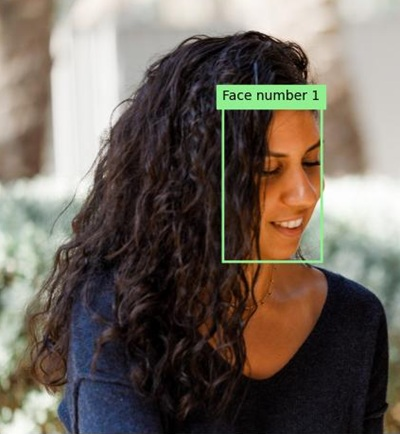

---
lab:
  title: 检测和分析人脸
  description: 使用 Azure AI 视觉人脸服务实现人脸检测和分析解决方案。
---

# 检测和分析人脸

检测和分析人脸的能力是一项核心 AI 功能。 在本练习中，你将探索“人脸”**** 服务以使用人脸。

> **注意**：本练习基于预发布版 SDK 软件，未来可能会有所变动。 必要时，我们使用了特定版本的包；这可能没有反映最新的可用版本。 可能会遇到一些意想不到的行为、警告或错误。

尽管本练习基于 Azure 视觉人脸 Python SDK，但你也可以使用多种语言特定的 SDK 开发视觉应用程序，包括：

* [适用于 JavaScript 的 Azure AI 视觉人脸](https://www.npmjs.com/package/@azure-rest/ai-vision-face)
* [适用于 Microsoft .NET 的 Azure AI 视觉人脸](https://www.nuget.org/packages/Azure.AI.Vision.Face)
* [适用于 Java 的 Azure AI 视觉人脸](https://central.sonatype.com/artifact/com.azure/azure-ai-vision-face)

此练习大约需要 **30** 分钟。

> **注意**：返回个人身份信息的 Azure AI 服务的功能仅限于被授予[有限访问权限](https://learn.microsoft.com/legal/cognitive-services/computer-vision/limited-access-identity)的客户。 本练习不包括面部识别任务，无需请求访问任何其他受限功能即可完成。

## 预配 Azure AI 人脸 API 资源

如果订阅中还没有 Azure AI 人脸 API 资源，则需要预配该资源。

> **注意**：在本练习中，你将使用独立的“人脸”**** 资源。 还可以直接使用 Azure AI 服务多服务资源中的 Azure AI 人脸服务，或在 Azure AI Foundry 项目中使用。****

1. 打开 [Azure 门户](https://portal.azure.com) (网址为 `https://portal.azure.com`)，然后使用你的 Azure 凭据登录。 关闭显示的任何欢迎消息或提示。
1. 选择“创建资源”。****
1. 在搜索栏中，搜索 `Face`，选择“人脸”****，并使用以下设置创建资源：
    - **订阅**：Azure 订阅
    - **资源组**：*创建或选择资源组*
    - **区域**：*选择任何可用区域*
    - **名称**：你的人脸资源的有效名称**
    - **定价层**：免费 F0

1. 创建资源并等待部署完成，然后查看部署详细信息。
1. 部署资源后，转到该资源，然后在导航窗格中的“资源管理”节点下查看其“密钥和终结点”页面。******** 你将在下一个过程中用到此页面中的终结点和其中一个密钥。

## 使用人脸 SDK 开发面部分析应用

在此练习中，你将完成一个已部分实现的客户端应用程序，该应用程序使用 Azure 人脸 SDK 来检测和分析图像中的人脸。

### 准备应用程序配置

1. 在 Azure 门户中，使用页面顶部搜索栏右侧的“[\>_]”按钮在 Azure 门户中创建新的 Cloud Shell，选择订阅中不含存储的“PowerShell”环境。**********

    在 Azure 门户底部的窗格中，Cloud Shell 提供命令行接口。

    > **备注**：如果以前创建了使用 *Bash* 环境的 Cloud Shell，请将其切换到 ***PowerShell***。

    > **注意**：如果门户要求你选择存储来保存文件，请选择“不需要存储帐户”，选择正在使用的订阅，然后按“应用”。********

1. 在 Cloud Shell 工具栏的“**设置**”菜单中，选择“**转到经典版本**”（这是使用代码编辑器所必需的）。

    **<font color="red">在继续作之前，请确保已切换到 Cloud Shell 的经典版本。</font>**

1. 重设 Cloud Shell 窗格的大小，以便你仍然可以看到人脸资源的“密钥和终结点”页面。****

    > 提示****：可以通过拖动上边框来调整窗格的大小。 还可以使用最小化和最大化按钮在 Cloud Shell 和主门户界面之间切换。

1. 在 Cloud Shell 窗格中，输入以下命令以克隆包含此练习代码文件的 GitHub 存储库（键入命令，或将其复制到剪贴板后，在命令行中右键单击并粘贴为纯文本）：

    ```
    rm -r mslearn-ai-vision -f
    git clone https://github.com/MicrosoftLearning/mslearn-ai-vision
    ```

    > **提示**：将命令粘贴到 Cloudshell 中时，输出可能会占用大量屏幕缓冲区。 可以通过输入 `cls` 命令来清除屏幕，以便更轻松地专注于每项任务。

1. 克隆存储库后，使用以下命令导航到应用程序代码文件：

    ```
   cd mslearn-ai-vision/Labfiles/face/python/face-api
   ls -a -l
    ```

    该文件夹包含应用的应用程序配置和代码文件。 它还包含 /images**** 子文件夹，其中包含应用将分析的某些图像文件。

1. 运行以下命令安装 Azure AI 视觉 SDK 包和其他所需包：

    ```
   python -m venv labenv
   ./labenv/bin/Activate.ps1
   pip install -r requirements.txt azure-ai-vision-face==1.0.0b2
    ```

1. 输入以下命令来编辑应用的配置文件：

    ```
   code .env
    ```

    该文件已在代码编辑器中打开。

1. 在代码文件中，更新它所包含的配置值以反映人脸资源的终结点和身份验证密钥（从Azure 门户的“密钥和终结点”页面复制）。************
1. 替换占位符后，使用 **Ctrl+S** 命令保存更改，然后使用 **Ctrl+Q** 命令关闭代码编辑器，同时使 Cloud Shell 命令行保持打开状态。

### 添加代码以创建人脸 API 客户端

1. 在 Cloud Shell 命令行中，输入以下命令以打开客户端应用程序的代码文件：

    ```
   code analyze-faces.py
    ```

    > **提示**：你可能希望最大化 Cloud Shell 窗格并在命令行控制台和代码编辑器之间移动拆分栏，以便更轻松地查看代码。

1. 在代码文件中，找到注释“导入命名空间”****，并添加以下代码以导入使用 Azure AI 视觉 SDK 所需的命名空间：

    ```python
   # Import namespaces
   from azure.ai.vision.face import FaceClient
   from azure.ai.vision.face.models import FaceDetectionModel, FaceRecognitionModel, FaceAttributeTypeDetection01
   from azure.core.credentials import AzureKeyCredential
    ```

1. 请注意，Main**** 函数中已提供用于加载配置设置和确定要分析的图像的代码。 然后找到注释“验证人脸客户端”，并添加以下代码以创建和验证 FaceClient 对象：********

    ```python
   # Authenticate Face client
   face_client = FaceClient(
        endpoint=cog_endpoint,
        credential=AzureKeyCredential(cog_key))
    ```

### 添加代码以检测和分析人脸

1. 在应用程序代码文件的 Main**** 函数中，找到注释“指定要检索的面部特征”**** 并添加以下代码：

    ```python
   # Specify facial features to be retrieved
   features = [FaceAttributeTypeDetection01.HEAD_POSE,
                FaceAttributeTypeDetection01.OCCLUSION,
                FaceAttributeTypeDetection01.ACCESSORIES]
    ```

1. 在 Main 函数中刚刚添加的代码下，找到注释“获取人脸”并添加以下代码，以输出面部特征信息并调用一个函数，该函数针对每个检测到的人脸使用边框来对图像添加批注（基于每个人脸的 face_rectangle 属性）：************

    ```Python
   # Get faces
   with open(image_file, mode="rb") as image_data:
        detected_faces = face_client.detect(
            image_content=image_data.read(),
            detection_model=FaceDetectionModel.DETECTION01,
            recognition_model=FaceRecognitionModel.RECOGNITION01,
            return_face_id=False,
            return_face_attributes=features,
        )

   face_count = 0
   if len(detected_faces) > 0:
        print(len(detected_faces), 'faces detected.')
        for face in detected_faces:
    
            # Get face properties
            face_count += 1
            print('\nFace number {}'.format(face_count))
            print(' - Head Pose (Yaw): {}'.format(face.face_attributes.head_pose.yaw))
            print(' - Head Pose (Pitch): {}'.format(face.face_attributes.head_pose.pitch))
            print(' - Head Pose (Roll): {}'.format(face.face_attributes.head_pose.roll))
            print(' - Forehead occluded?: {}'.format(face.face_attributes.occlusion["foreheadOccluded"]))
            print(' - Eye occluded?: {}'.format(face.face_attributes.occlusion["eyeOccluded"]))
            print(' - Mouth occluded?: {}'.format(face.face_attributes.occlusion["mouthOccluded"]))
            print(' - Accessories:')
            for accessory in face.face_attributes.accessories:
                print('   - {}'.format(accessory.type))
            # Annotate faces in the image
            annotate_faces(image_file, detected_faces)
    ```

1. 检查添加到 Main**** 函数的代码。 它会分析图像文件并检测其中包含的任何人脸及其特征，包括头部姿势、遮挡以及是否佩戴眼镜等配饰。 此外，调用一个函数来为原始图像添加批注，并为每个检测到的人脸添加边框。
1. 保存更改 (Ctrl+S**)，但如果需要修复任何拼写错误，请确保代码编辑器处于打开状态。

1. 调整窗格的大小，以便查看更多控制台，然后输入以下命令以使用参数 images/face1.jpg** 运行程序：

    ```
   python analyze-faces.py images/face1.jpg
    ```

    应用运行和分析以下图像：

    

1. 观察输出，输出中应包含检测到的每张人脸的 ID 和特征。 
1. 请注意，还会生成名为 detected_faces.jpg**** 的图像文件。 使用（特定于 Azure Cloud Shell）“下载”**** 命令进行下载：

    ```
   download detected_faces.jpg
    ```

    下载命令会在浏览器右下角创建弹出链接，可以选择此链接下载并打开文件。 图像应如下所示：

    

1. 再次运行程序，这次指定参数 images/face2.jpg**，以从下图中提取文本：

    

    ```
   python analyze-faces.py images/face2.jpg
    ```

1. 下载并查看生成的 detected_faces.jpg**** 文件：

    ```
   download detected_faces.jpg
    ```

    生成的图像应如下所示：

    

1. 再次运行程序，这次指定参数 images/faces.jpg**，以从这张图像中提取文本：

    

    ```
   python analyze-faces.py images/faces.jpg
    ```

1. 下载并查看生成的 detected_faces.jpg**** 文件：

    ```
   download detected_faces.jpg
    ```

    生成的图像应如下所示：

    

## 清理资源

如果已完成 Azure AI 视觉的探索，则应删除在本练习中创建的资源，以避免产生不必要的 Azure 成本：

1. 打开 Azure 门户网站 `https://portal.azure.com`，在顶部搜索栏中搜索在本实验室中创建的资源。

1. 在资源页面上，选择**删除**，然后按照说明删除资源。 或者，也可以删除整个资源组，同时清理所有资源。
