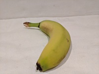

---
lab:
  title: 对图像进行分类
  description: 使用 Azure AI 自定义视觉服务来训练图像分类模型。
---

# 图像分类

使用 **Azure AI 自定义视觉**服务可创建计算机视觉模型并基于自己的图像进行训练。 可以使用该服务来训练*图像分类*和*对象检测*模型；然后可以在应用程序中发布并使用这两个模型。

在此练习中，你将使用自定义视觉服务来训练图像分类模型，该模型可识别三种水果（苹果、香蕉和橙子）。

尽管本练习基于 Azure 自定义视觉 Python SDK，但你也可以使用多种语言特定的 SDK 开发视觉应用程序，包括：

* [适用于 JavaScript 的 Azure 自定义视觉（训练）](https://www.npmjs.com/package/@azure/cognitiveservices-customvision-training)
* [适用于 JavaScript 的 Azure 自定义视觉（预测）](https://www.npmjs.com/package/@azure/cognitiveservices-customvision-prediction)
* [适用于 Microsoft .NET 的 Azure 自定义视觉（训练）](https://www.nuget.org/packages/Microsoft.Azure.CognitiveServices.Vision.CustomVision.Training/)
* [适用于 Microsoft .NET 的 Azure 自定义视觉（预测）](https://www.nuget.org/packages/Microsoft.Azure.CognitiveServices.Vision.CustomVision.Prediction/)
* [适用于 Java 的 Azure 自定义视觉（训练）](https://search.maven.org/artifact/com.azure/azure-cognitiveservices-customvision-training/1.1.0-preview.2/jar)
* [适用于 Java 的 Azure 自定义视觉（预测）](https://search.maven.org/artifact/com.azure/azure-cognitiveservices-customvision-prediction/1.1.0-preview.2/jar)

本练习大约需要 **45** 分钟。

## 创建自定义视觉资源

需要先获取可用于*训练*和*预测*的 Azure 资源才能训练模型。 可以为这些任务中的每个任务创建“自定义视觉”资源，也可以创建一个资源，然后在两个任务中使用。**** 在本练习中，你将创建用于训练和预测“自定义视觉”资源。****

1. 打开 [Azure 门户](https://portal.azure.com) (网址为 `https://portal.azure.com`)，然后使用你的 Azure 凭据登录。 关闭显示的任何欢迎消息或提示。
1. 选择“创建资源”。****
1. 在搜索栏中，搜索 `Custom Vision`，选择“自定义视觉”****，并使用以下设置创建资源：
    - **创建选项**：共同点
    - **订阅**：*Azure 订阅*
    - **资源组**：*创建或选择资源组*
    - **区域**：*选择任何可用区域*
    - **名称**：自定义视觉资源的有效名称**
    - **训练定价层**：F0
    - **预测定价层**：F0

1. 创建资源并等待部署完成，然后查看部署详细信息。 注意，已预配两个自定义视觉资源：一个用于训练，另一个用于预测。

    > **注意**：每个资源都有自己的终结点和密钥，用于管理来自代码的访问****。 若要训练图像分类模型，代码必须使用*训练*资源（及其终结点和密钥）；若要使用经过训练的模型来预测图像类别，代码必须使用*预测*资源（及其终结点和密钥）。

1. 部署资源后，请转到资源组查看资源。 你会看到两个自定义视觉资源，一个带有后缀 -Prediction******。

## 在自定义视觉门户中创建一个自定义视觉项目

若要训练图像分类模型，需根据训练资源创建自定义视觉项目。 为此，你将使用自定义视觉门户。

1. 打开新的浏览器标签页（使 Azure 门户标签页保持打开状态，稍后将返回该标签页）。
1. 在新的浏览器标签页中，打开[自定义视觉门户](https://customvision.ai)（网址为 `https://customvision.ai`）。 如果出现提示，请使用 Azure 凭据登录并同意服务条款。
1. 在自定义视觉门户中，创建一个具有以下设置的新项目：
    - **名称**：`Classify Fruit`
    - **说明**：`Image classification for fruit`
    - **资源**：自定义视觉资源**
    - **项目类型**：分类
    - **分类类型**：多类（每个图像一个标记）
    - **域**：食品

### 上传和标记图像

1. 在新的浏览器标签页中，从 `https://github.com/MicrosoftLearning/mslearn-ai-vision/raw/main/Labfiles/image-classification/training-images.zip` 中下载[训练图像](https://github.com/MicrosoftLearning/mslearn-ai-vision/raw/main/Labfiles/image-classification/training-images.zip)并解压缩 zip 文件夹以查看其内容。 此文件夹包含含苹果、香蕉和橙子图像的子文件夹。
1. 在自定义视觉门户的图像分类项目中，单击“添加图像”，然后选择先前下载并解压缩的 training-images/apple 文件夹中的所有文件。******** 然后上传图像文件，指定标记 `apple`，如下所示：

    

1. 使用“添加图像”([+]) 工具栏图标，重复上一步操作，上传“香蕉”文件夹中带有标记 `banana` 的图像，以及“橘子”文件夹中带有标记 `orange` 的图像。****************
1. 浏览已在自定义视觉项目中上传的图像 - 每个类应有 15 个图像，如下所示：

    

### 训练模型

1. 在自定义视觉项目的图像上方，单击“训练”(&#9881;<sub>&#9881;</sub>) **** 以使用已标记的图像训练分类模型。 选择**快速训练**选项，然后等待训练迭代完成（这可能需要一分钟左右）。
1. 模型迭代已训练后，请查看*精度*、*召回率*和*AP*性能指标 - 这些指标度量分类模型的预测准确性，并且应该都很高。

    

> **注意**：性能指标基于 50% 这一概率阈值来实现每一次预测（也就是说，如果模型计算得出图像为某特定类别的概率为 50% 或更高，则预测其为该类别）。 可以在页面左上角调整该阈值。

### 测试模型

1. 在性能指标上方，单击“快速测试”。
1. 在“图像 URL”框中，键入 `https://aka.ms/test-apple` 并单击“快速测试图像 (&#10132;)”按钮。
1. 查看模型返回的预测 -*苹果*的概率分数应为最高，如下所示：

    

1. 尝试测试以下图像：
    - `https://aka.ms/test-banana`
    - `https://aka.ms/test-orange`

1. 关闭**快速测试**窗口。

### 查看项目设置

你创建的项目已分配有唯一标识符，你需要在与其交互的任意代码中指定该标识符。

1. 单击**性能**页面右上方的*设置*(&#9881;) 图标，查看项目设置。
1. 在**常规**（左侧）下，注意唯一标识该项目的**项目 ID**。
1. 在右侧的**资源**下，可看到显示了密钥和终结点。 这些是*训练*资源的详细信息（还可通过在 Azure 门户中查看资源来获取这些信息）。

## 使用*训练* API

自定义视觉门户提供了方便的用户界面，可用于上传和标记图像，以及训练模型。 但在某些情况下，你可能想要使用自定义视觉训练 API 自动训练模型。

### 准备应用程序配置

1. 返回到打开 Azure 门户的浏览器标签页（使自定义视觉门户标签页保持打开状态，稍后将返回该标签页）。
1. 在 Azure 门户中，使用页面顶部搜索栏右侧的“[\>_]”按钮在 Azure 门户中创建新的 Cloud Shell，选择订阅中不含存储的“PowerShell”环境。**********

    在 Azure 门户底部的窗格中，Cloud Shell 提供命令行接口。

    > **备注**：如果以前创建了使用 *Bash* 环境的 Cloud Shell，请将其切换到 ***PowerShell***。

    > **注意**：如果门户要求你选择存储来保存文件，请选择“不需要存储帐户”，选择正在使用的订阅，然后按“应用”。********

1. 在 Cloud Shell 工具栏的“**设置**”菜单中，选择“**转到经典版本**”（这是使用代码编辑器所必需的）。

    **<font color="red">在继续作之前，请确保已切换到 Cloud Shell 的经典版本。</font>**

1. 重设 Cloud Shell 窗格的大小，以便看到更多内容。

    > 提示****：可以通过拖动上边框来调整窗格的大小。 还可以使用最小化和最大化按钮在 Cloud Shell 和主门户界面之间切换。

1. 在 Cloud Shell 窗格中，输入以下命令以克隆包含此练习代码文件的 GitHub 存储库（键入命令，或将其复制到剪贴板后，在命令行中右键单击并粘贴为纯文本）：

    ```
    rm -r mslearn-ai-vision -f
    git clone https://github.com/MicrosoftLearning/mslearn-ai-vision
    ```

    > **提示**：将命令粘贴到 cloudshell 中时，输出可能会占用大量屏幕缓冲区。 可以通过输入 `cls` 命令来清除屏幕，以便更轻松地专注于每项任务。

1. 克隆存储库后，使用以下命令导航到应用程序代码文件：

    ```
   cd mslearn-ai-vision/Labfiles/image-classification/python/train-classifier
   ls -a -l
    ```

    该文件夹包含应用的应用程序配置和代码文件。 它还包含 /more-training-images**** 子文件夹，其中包含一些图像文件，用于执行模型的其他训练。

1. 运行以下命令，安装用于训练的 Azure AI 自定义视觉 SDK 包和其他所需包：

    ```
   python -m venv labenv
   ./labenv/bin/Activate.ps1
   pip install -r requirements.txt azure-cognitiveservices-vision-customvision
    ```

1. 输入以下命令来编辑应用的配置文件：

    ```
   code .env
    ```

    该文件已在代码编辑器中打开。

1. 在代码文件中，更新其中包含的配置值，以反映自定义视觉训练资源的终结点和身份验证密钥，以及先前创建的自定义视觉项目的项目 ID。**************
1. 替换占位符后，使用 Ctrl+S**** 命令保存更改，然后使用 Ctrl+Q**** 命令关闭代码编辑器，同时保持 Cloud Shell 命令行打开。

### 编写代码以执行模型训练

1. 在 Cloud Shell 命令行中，输入以下命令以打开客户端应用程序的代码文件：

    ```
   code train-classifier.py
    ```

1. 请注意代码文件中的以下详细信息：
    - 导入了 Azure AI 自定义视觉 SDK 的命名空间。
    - Main 函数会检索配置设置，并使用密钥和终结点来创建经身份验证的客户端。****
    - CustomVisionTrainingClient****，与项目 ID 一起使用，以创建对项目的项目引用。****
    - **Upload_Images** 函数检索自定义视觉项目中定义的标记，然后将图像文件从相应名称的文件夹上传到项目，并分配适当的标记 ID。
    - **Train_Model** 函数为项目创建新的训练迭代，然后等待训练完成。

1. 关闭代码编辑器 (Ctrl+Q**)，输入以下命令以运行程序：

    ```
   python train-classifier.py
    ```

1. 等待程序结束。 然后返回到打开自定义视觉门户的浏览器标签页，并查看项目的“训练图像”页面（如有必要，请刷新浏览器）。****
1. 验证某些带标记的新图像是否已添加到项目中。 然后，查看**性能**页面，并验证是否已创建新迭代。

## 在客户端应用程序中使用图像分类器

现在，你已准备好发布经过训练的模型并在客户端应用程序中使用该模型了。

### 发布图像分类模型

1. 在自定义视觉门户的**性能**页面上，单击 **&#128504; 发布**以使用以下设置发布经过训练的模型 ：
    - 模型名称****：`fruit-classifier`
    - **预测资源**：*先前创建的以**Prediction**结尾的预测资源（<u>不是</u>训练资源）*。
1. 在**项目设置**页面的左上角，单击*项目库*(&#128065;) 图标以返回到自定义视觉门户主页，此时其中列出了你的项目。
1. 在自定义视觉门户主页的右上角，单击*设置*(&#9881;) 图标以查看自定义视觉服务的设置。 然后，在**资源**下查找以-Prediction结尾的*预测*资源（<u>不是</u>训练资源），以确定其**密钥**和**终结点**值（也可以通过在 Azure 门户中查看资源来获取这些信息）。

### 使用客户端应用程序中的图像分类器

1. 返回到打开 Azure 门户和 Cloud Shell 窗格的浏览器标签页。
1. 在 Cloud Shell 中运行以下命令，切换到客户端应用程序的文件夹并查看其中包含的文件：

    ```
   cd ../test-classifier
   ls -a -l
    ```

    该文件夹包含应用的应用程序配置和代码文件。 它还包含 /test-images**** 子文件夹，其中包含用于测试模型的一些图像文件。

1. 运行以下命令，安装用于预测的 Azure AI 自定义视觉 SDK 包和其他所需包：

    ```
   python -m venv labenv
   ./labenv/bin/Activate.ps1
   pip install -r requirements.txt azure-cognitiveservices-vision-customvision
    ```

1. 输入以下命令来编辑应用的配置文件：

    ```
   code .env
    ```

    该文件已在代码编辑器中打开。

1. 更新配置值，以反映自定义视觉<u>预测</u>资源的终结点和密钥、分类项目的项目 ID 以及已发布模型的名称（应为 fruit-classifier）。**************** 保存更改 (Ctrl+S) 并关闭代码编辑器 (Ctrl+Q)。****
1. 在 Cloud Shell 命令行中，输入以下命令以打开客户端应用程序的代码文件：

    ```
   code test-classifier.py
    ```

1. 查看代码，并注意以下详细信息：
    - 导入了 Azure AI 自定义视觉 SDK 的命名空间。
    - **Main** 函数检索配置设置，并使用密钥和终结点创建经过身份验证的 **CustomVisionPredictionClient**。
    - 预测客户端对象用于预测 **test-images** 文件夹中每个图像的类别，并为每个请求指定项目 ID 和模型名称。 每个预测均包含每个可能类别的概率，但仅显示概率超过 50% 的预测标记。

1. 关闭代码编辑器，输入以下命令以运行程序：

    ```
   python test-classifier.py
    ```

    程序将以下每个图像提交到模型进行分类：

    

    IMG_TEST_1.jpg****

    <br/><br/>

    

    IMG_TEST_2.jpg****

    <br/><br/>

    

    IMG_TEST_3.jpg****

1. 查看每个预测的标签（标记）和概率分数。

## 清理资源

如果已完成 Azure AI 自定义视觉的探索，则应删除在本练习中创建的资源，以避免产生不必要的 Azure 成本：

1. 打开 Azure 门户网站 `https://portal.azure.com`，在顶部搜索栏中搜索在本实验室中创建的资源。

1. 在资源页面上，选择**删除**，然后按照说明删除资源。 或者，也可以删除整个资源组，同时清理所有资源。
