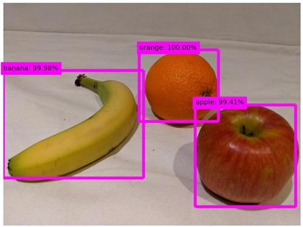

---
lab:
  title: 在图像中检测对象
  description: 使用 Azure AI 自定义视觉服务来训练物体检测模型。
---

# 在图像中检测对象

使用 **Azure AI 自定义视觉**服务可创建计算机视觉模型并基于自己的图像进行训练。 可以使用该服务来训练*图像分类*和*对象检测*模型；然后可以在应用程序中发布并使用这两个模型。

在此练习中，你将使用自定义视觉服务来训练*对象检测*模型，该模型可检测并找到图像中的三种水果（苹果、香蕉和橙子）。

尽管本练习基于 Azure 自定义视觉 Python SDK，但你也可以使用多种语言特定的 SDK 开发视觉应用程序，包括：

* [适用于 JavaScript 的 Azure 自定义视觉（训练）](https://www.npmjs.com/package/@azure/cognitiveservices-customvision-training)
* [适用于 JavaScript 的 Azure 自定义视觉（预测）](https://www.npmjs.com/package/@azure/cognitiveservices-customvision-prediction)
* [适用于 Microsoft .NET 的 Azure 自定义视觉（训练）](https://www.nuget.org/packages/Microsoft.Azure.CognitiveServices.Vision.CustomVision.Training/)
* [适用于 Microsoft .NET 的 Azure 自定义视觉（预测）](https://www.nuget.org/packages/Microsoft.Azure.CognitiveServices.Vision.CustomVision.Prediction/)
* [适用于 Java 的 Azure 自定义视觉（训练）](https://search.maven.org/artifact/com.azure/azure-cognitiveservices-customvision-training/1.1.0-preview.2/jar)
* [适用于 Java 的 Azure 自定义视觉（预测）](https://search.maven.org/artifact/com.azure/azure-cognitiveservices-customvision-prediction/1.1.0-preview.2/jar)

本练习大约需要 **45** 分钟。

## 创建自定义视觉资源

需要先获取可用于*训练*和*预测*的 Azure 资源才能训练模型。 可以为这些任务中的每个任务创建“自定义视觉”资源，也可以创建一个资源，然后在两个任务中使用。**** 在本练习中，你将创建用于训练和预测“自定义视觉”资源。****

1. 打开 [Azure 门户](https://portal.azure.com) (网址为 `https://portal.azure.com`)，然后使用你的 Azure 凭据登录。 关闭显示的任何欢迎消息或提示。
1. 选择“创建资源”。****
1. 在搜索栏中，搜索 `Custom Vision`，选择“自定义视觉”****，并使用以下设置创建资源：
    - **创建选项**：共同点
    - **订阅**：*Azure 订阅*
    - **资源组**：*创建或选择资源组*
    - **区域**：*选择任何可用区域*
    - **名称**：自定义视觉资源的有效名称**
    - **训练定价层**：F0
    - **预测定价层**：F0

1. 创建资源并等待部署完成，然后查看部署详细信息。 注意，已预配两个自定义视觉资源：一个用于训练，另一个用于预测。

    > **注意**：每个资源都有自己的终结点和密钥，用于管理来自代码的访问****。 若要训练图像分类模型，代码必须使用*训练*资源（及其终结点和密钥）；若要使用经过训练的模型来预测图像类别，代码必须使用*预测*资源（及其终结点和密钥）。

1. 部署资源后，请转到资源组查看资源。 你会看到两个自定义视觉资源，一个带有后缀 -Prediction******。

## 在自定义视觉门户中创建一个自定义视觉项目

若要训练对象检测模型，需要基于训练资源创建自定义视觉项目。 为此，你将使用自定义视觉门户。

1. 打开新的浏览器标签页（使 Azure 门户标签页保持打开状态，稍后将返回该标签页）。
1. 在新的浏览器标签页中，打开[自定义视觉门户](https://customvision.ai)（网址为 `https://customvision.ai`）。 如果出现提示，请使用 Azure 凭据登录并同意服务条款。
1. 创建一个具有以下设置的新项目：
    - **名称**：`Detect Fruit`
    - **说明**：`Object detection for fruit.`
    - **资源**：自定义视觉资源**
    - **项目类型**：对象检测
    - **域**：常规
1. 等待项目创建并在浏览器中打开。

## 上传和标记图像

有了物体检测项目后，即可上传并标记图像以训练模型。

### 在自定义视觉门户中上传并标记图像

自定义视觉门户包括一些视觉工具，可用于上传图像并标记其中包含多种物体的区域。

1. 在新的浏览器标签页中，从 `https://github.com/MicrosoftLearning/mslearn-ai-vision/raw/main/Labfiles/object-detection/training-images.zip` 中下载[训练图像](https://github.com/MicrosoftLearning/mslearn-ai-vision/raw/main/Labfiles/object-detection/training-images.zip)并解压缩 zip 文件夹以查看其内容。 此文件夹包含水果图像。
1. 在自定义视觉门户中的物体检测项目中，选择**添加图像**并上传提取的文件夹中的所有图像。
1. 上传图像后，选择第一个图像将其打开。
1. 将鼠标悬停在图像中的任意对象上，直到自动检测到的区域如下图所示。 然后选择对象，并根据需要调整区域大小以将其环绕。

    

    或者，只需在对象周围拖动以创建区域。

1. 当区域环绕对象时，使用相应的对象类型（*苹果*、*香蕉*或*橘子*）添加新标记，如下所示：

    

1. 选择并标记图像中的各个对象，从而根据需要调整区域大小并添加新标记。

    

1. 使用右侧的 **>** 链接转到下一个图像，并标记其对象。 然后，继续处理整个图像集合，标记每个苹果、香蕉和橘子。

1. 标记完最后一个图像后，请关闭“**图像详细信息**”编辑器。 在“**训练图像**”页的“**标记**”下，选择“**已标记**”以查看所有标记的图像：


### 使用自定义视觉 SDK 上传图像

可以使用“自定义视觉”门户中的 UI 对图像进行标记，但许多 AI 开发团队会使用其他工具来生成包含有关图像中的标记和对象区域信息的文件。 在此类情况下，可以使用自定义视觉训练 API 将带标记的图像上传到项目。

1. 单击自定义视觉门户中**训练图像**页面右上方的*设置*(&#9881;) 图标，查看项目设置。
1. 在**常规**（左侧）下，注意唯一标识该项目的**项目 ID**。
1. 在右侧的“资源”下，可看到显示了密钥和终结点。************ 这些是*训练*资源的详细信息（还可通过在 Azure 门户中查看资源来获取这些信息）。
1. 返回到打开 Azure 门户的浏览器标签页（使自定义视觉门户标签页保持打开状态，稍后将返回该标签页）。
1. 在 Azure 门户中，使用页面顶部搜索栏右侧的“[\>_]”按钮在 Azure 门户中创建新的 Cloud Shell，选择订阅中不含存储的“PowerShell”环境。**********

    在 Azure 门户底部的窗格中，Cloud Shell 提供命令行接口。

    > **备注**：如果以前创建了使用 *Bash* 环境的 Cloud Shell，请将其切换到 ***PowerShell***。

    > **注意**：如果门户要求你选择存储来保存文件，请选择“不需要存储帐户”，选择正在使用的订阅，然后按“应用”。********

1. 在 Cloud Shell 工具栏的“**设置**”菜单中，选择“**转到经典版本**”（这是使用代码编辑器所必需的）。

    **<font color="red">在继续作之前，请确保已切换到 Cloud Shell 的经典版本。</font>**

1. 重设 Cloud Shell 窗格的大小，以便看到更多内容。

    > 提示****：可以通过拖动上边框来调整窗格的大小。 还可以使用最小化和最大化按钮在 Cloud Shell 和主门户界面之间切换。

1. 在 Cloud Shell 窗格中，输入以下命令以克隆包含此练习代码文件的 GitHub 存储库（键入命令，或将其复制到剪贴板后，在命令行中右键单击并粘贴为纯文本）：

    ```
    rm -r mslearn-ai-vision -f
    git clone https://github.com/MicrosoftLearning/mslearn-ai-vision
    ```

    > **提示**：将命令粘贴到 cloudshell 中时，输出可能会占用大量屏幕缓冲区。 可以通过输入 `cls` 命令来清除屏幕，以便更轻松地专注于每项任务。

1. 克隆存储库后，使用以下命令导航到应用程序代码文件：

    ```
   cd mslearn-ai-vision/Labfiles/object-detection/python/train-detector
   ls -a -l
    ```

    该文件夹包含应用的应用程序配置和代码文件。 它还包含 tagged-images.json**** 文件（包含多个图像中的物体的边框坐标）和 /images**** 子文件夹（包含图像）。

1. 运行以下命令，安装用于训练的 Azure AI 自定义视觉 SDK 包和其他所需包：

    ```
   python -m venv labenv
   ./labenv/bin/Activate.ps1
   pip install -r requirements.txt azure-cognitiveservices-vision-customvision
    ```

1. 输入以下命令来编辑应用的配置文件：

    ```
   code .env
    ```

    该文件已在代码编辑器中打开。

1. 在代码文件中，更新其中包含的配置值，以反映自定义视觉训练资源的终结点和身份验证密钥，以及先前创建的自定义视觉项目的项目 ID。**************
1. 替换占位符后，使用 Ctrl+S**** 命令保存更改，然后使用 Ctrl+Q**** 命令关闭代码编辑器，同时保持 Cloud Shell 命令行打开。
1. 在 Cloud Shell 命令行中，输入以下命令以打开 tagged-images.json**** 文件，以在 /images**** 子文件夹中查看图像文件的标记信息：

    ```
   code tagged-images.json
    ```
    
     JSON 定义了一个图像列表，每个图像包含一个或多个带标记的区域。 每个带标记的区域均包括标记名称、顶部和左侧坐标，以及含带标记对象的边界框的宽度和高度维度。

    > **注意**：此文件中的坐标和维度表示在图像上的相对位置。 例如，*高度*值 0.7 表示框的高度是图像高度的 70%。 某些标记工具会生成其他格式的文件，其中坐标和维度值体现为像素、英寸或其他度量单位。

1. 关闭 JSON 文件而不保存任何更改 (CTRL_Q**)。

1. 在 Cloud Shell 命令行中，输入以下命令以打开客户端应用程序的代码文件：

    ```
   code add-tagged-images.py
    ```

1. 请注意代码文件中的以下详细信息：
    - 导入了 Azure AI 自定义视觉 SDK 的命名空间。
    - **Main** 函数检索配置设置，并使用密钥和终结点来创建经过身份验证的 **CustomVisionTrainingClient**，然后将其与**项目** ID 结合使用以创建对项目的项目引用。
    - **Upload_Images** 函数从 JSON 文件提取带标记的区域信息，并按照该信息创建一批具有区域的图像，然后将其上传到项目。

1. 关闭代码编辑器 (Ctrl+Q**)，输入以下命令以运行程序：

    ```
   python add-tagged-images.py
    ```

1. 等待程序结束。
1. 切换回打开自定义视觉门户的浏览器标签页（使 Azure 门户 Cloud Shell 标签页保持打开状态），并查看项目的“训练图像”页面（如有必要，请刷新浏览器）。****
1. 验证某些带标记的新图像是否已添加到项目中。

## 训练和测试模型

现在你已标记项目中的图像，即可训练模型。

1. 在自定义视觉项目中，单击“训练”****(&#9881;<sub>&#9881;</sub>) 以使用已标记的图像训练物体检测模型。 选择**快速训练**选项。
1. 等待训练完成（可能需要十分钟左右）。

    > **提示**：Azure Cloud Shell 具有 20 分钟的非活动超时，在此时间之后，将放弃此会话。 在等待训练完成时，会暂时返回 Cloud Shell，并输入一个命令（如 `ls`）使会话保持活动状态。

1. 在自定义视觉门户中，训练完成后，查看“精准率”**、“召回率”** 和“mAP”** 性能指标，这些指标度量物体检测模型的预测准确性，并且这些指标应该都很高。
1. 在页面右上角，单击“快速测试”，然后在“图像 URL”框中，键入 `https://aka.ms/test-fruit` 并单击“快速测试图像”(&#10132;) 按钮。**********
1. 查看生成的预测。

    

1. 关闭**快速测试**窗口。

## 在客户端应用程序中使用物体检测器

现在，你已准备好发布经过训练的模型并在客户端应用程序中使用该模型了。

### 发布对象检测模型

1. 在自定义视觉门户的**性能**页面上，单击 **&#128504; 发布**以使用以下设置发布经过训练的模型 ：
    - 模型名称****：`fruit-detector`
    - **预测资源**：*先前创建的以**Prediction**结尾的预测资源（<u>不是</u>训练资源）*。
1. 在**项目设置**页面的左上角，单击*项目库*(&#128065;) 图标以返回到自定义视觉门户主页，此时其中列出了你的项目。
1. 在自定义视觉门户主页的右上角，单击*设置*(&#9881;) 图标以查看自定义视觉服务的设置。 然后，在**资源**下查找以-Prediction结尾的*预测*资源（<u>不是</u>训练资源），以确定其**密钥**和**终结点**值（也可以通过在 Azure 门户中查看资源来获取这些信息）。

## 使用客户端应用程序中的图像分类器

现在，你已经发布了图像分类模型，接下来，可在客户端应用程序中使用。 同样，可以选择使用 **C#** 或 **Python**。

1. 返回到打开 Azure 门户和 Cloud Shell 窗格的浏览器标签页。
1. 在 Cloud Shell 中运行以下命令，切换到客户端应用程序的文件夹并查看其中包含的文件：

    ```
   cd ../test-detector
   ls -a -l
    ```

    该文件夹包含应用的应用程序配置和代码文件。 它还包含以下 produce.jpg**** 图像文件，用于测试模型。

    

1. 运行以下命令，安装用于预测的 Azure AI 自定义视觉 SDK 包和其他所需包：

    ```
   python -m venv labenv
   ./labenv/bin/Activate.ps1
   pip install -r requirements.txt azure-cognitiveservices-vision-customvision
    ```

1. 输入以下命令来编辑应用的配置文件：

    ```
   code .env
    ```

    该文件已在代码编辑器中打开。

1. 更新配置值，以反映自定义视觉<u>预测</u>资源的终结点和密钥、物体检测项目的项目 ID 以及已发布模型的名称（应为 fruit-detector）。**************** 保存更改 (Ctrl+S) 并关闭代码编辑器 (Ctrl+Q)。****

1. 在 Cloud Shell 命令行中，输入以下命令以打开客户端应用程序的代码文件：

    ```
   code test-detector.py
    ```

1. 查看代码，并注意以下详细信息：
    - 导入了 Azure AI 自定义视觉 SDK 的命名空间。
    - **Main** 函数检索配置设置，并使用密钥和终结点创建经过身份验证的 **CustomVisionPredictionClient**。
    - 预测客户端对象用于获取 **produce.jpg** 图像的对象检测预测，并指定请求中的项目 ID 和模型名称。 然后，预测的带标记的区域会绘制在图像上，并且结果将另存为 **output.jpg**。
1. 关闭代码编辑器，输入以下命令以运行程序：

    ```
   python test-detector.py
    ```

1. 查看程序输出，其中列出了在图像中检测到的每个物体。
1. 请注意，将生成名为 output.jpg**** 的图像文件。 使用（特定于 Azure Cloud Shell）“下载”**** 命令进行下载：

    ```
   download output.jpg
    ```

    下载命令会在浏览器右下角创建弹出链接，可以选择此链接下载并打开文件。 图像应如下所示：

    

## 清理资源

如果不将本实验室创建的 Azure 资源用于其他培训模块，则可以删除这些资源以避免产生更多费用。

1. 打开 Azure 门户网站 `https://portal.azure.com`，在顶部搜索栏中搜索在本实验室中创建的资源。

1. 在资源页面上，选择**删除**，然后按照说明删除资源。 或者，也可以删除整个资源组，同时清理所有资源。
   
## 详细信息

若要详细了解自定义视觉服务中的对象检测，请参阅[自定义视觉文档](https://docs.microsoft.com/azure/cognitive-services/custom-vision-service/)。
