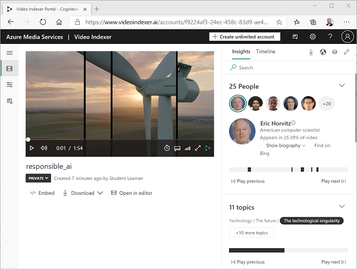
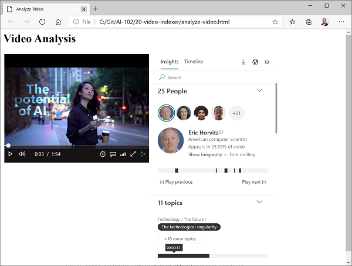

---
lab:
  title: 分析视频
  description: 使用 Azure AI 视频索引器分析视频。
---

# 分析视频

当今创建和使用的数据大都是视频格式数据。 **Azure AI 视频索引器**是一项 AI 助力的服务，可用于索引视频并从中提取见解。

> **注意**：从 2022 年 6 月 21 日开始，返回个人身份信息的 Azure AI 服务的功能仅限于被授予[有限访问权限](https://docs.microsoft.com/azure/cognitive-services/cognitive-services-limited-access)的客户。 在未获得有限访问权限批准的情况下，本实验室无法使用视频索引器识别人物和名人。 有关 Microsoft 所做的更改的更多详细信息，以及原因 - 请参阅[负责任 AI 投资和面部识别防护措施](https://azure.microsoft.com/blog/responsible-ai-investments-and-safeguards-for-facial-recognition/)。

## 将视频上传到视频索引器

首先，你需要登录到视频索引器门户并上传视频。

1. 在浏览器中，打开[视频索引器门户](https://www.videoindexer.ai)（网址为 `https://www.videoindexer.ai`）。
1. 如果你有现有的视频索引器帐户，请登录。 否则，请注册一个免费帐户并使用 Microsoft 帐户（或任何其他有效帐户类型）登录。 如果登录过程中遇到问题，请尝试打开专用浏览器会话。

    > 注意:如果这是你首次登录，可能会看到一个弹出窗体，要求你确认使用该服务的方式。 

1. 在新的选项卡中，通过访问 `https://aka.ms/responsible-ai-video` 下载负责任 AI 视频。 保存文件。
1. 在视频索引器中，选择“上传”**** 选项。 然后，选择“浏览文件”的选项，选择下载的视频并单击“添加”********。 将“文件名”字段中的文本更改为“负责任 AI”。******** 选择“查看 + 上传”，查看摘要概述，选中复选框以确认符合 Microsoft 针对面部识别的政策，然后上传文件。****
1. 文件上传后，等待几分钟，视频索引器随后会自动索引。

> **注意**：在本练习中，我们将使用此视频来探索视频索引器的功能。但在完成练习后，你应该花点时间完整地观看此视频，因为其中包含用于负责任地开发支持 AI 的应用程序的有用信息和指导。 

## 查看视频见解

索引过程从视频中提取见解，你可以在门户中查看这些见解。

1. 在视频索引器门户中，索引视频后，选择该视频进行观看。 你将在窗格旁边看到视频播放器，该窗格显示从视频中提取的见解。

    > **注意**：由于保护个人标识的访问策略有限，因此在为视频编制索引时可能不会看到名称。

    

1. 播放视频时，选择**时间线**选项卡以查看视频音频的字幕。

    

1. 在门户的右上角，选择**查看**符号（外观类似于 &#128455;），在见解列表中，除了**字幕**之外，还要选择**OCR**和**说话人**。

    

1. 请注意，**时间线**窗格现在包括：
    - 音频旁白字幕。
    - 在视频中可见的文本。
    - 视频中出现的说话人指示。 有些知名人士会自动通过名字识别，其他人则用数字表示（例如*说话人 #1*）。
1. 切换回**见解**窗格并查看此处显示的见解。 它们包括：
    - 视频中出现的个人。
    - 视频中讨论的主题。
    - 视频中出现的物体的标签。
    - 视频中出现的命名实体，例如人员和品牌。
    - 关键场景。
1. 在**见解**窗格可见的情况下，再次选择**查看**符号，并在见解列表中，将**关键字**和**情绪**添加到该窗格中。

    发现的见解可以帮助你确定视频中的主要主题。 例如，此视频的**主题**表明，它显然与技术、社会责任和道德规范有关。

## 搜索见解

你可以使用视频索引器在视频中搜索见解。

1. 在**见解**窗格中的**搜索**框中，输入*蜜蜂*。 建议在见解窗格中向下滚动以查看所有见解类型的结果。
1. 注意，找到一个匹配的*标签*，位于下面视频中指示的位置。
1. 选择指示有蜜蜂存在的部分的开头，然后在该位置观看视频（建议暂停视频并仔细选择，蜜蜂只会短暂出现。）

    

1. 清除**搜索**框以显示视频中的所有见解。

## 使用视频索引器 REST API

视频索引器提供了一个 REST API，你可以使用该 API 上传和管理帐户中的视频。

1. 在新的浏览器标签页中，打开 [Azure 门户](https://portal.azure.com)（网址为`https://portal.azure.com`），然后使用你的 Azure 凭据登录。 确保视频索引器门户所在的现有标签页处于打开状态。
1. 在 Azure 门户中，使用页面顶部搜索栏右侧的“[\>_]”按钮在 Azure 门户中创建新的 Cloud Shell，选择订阅中不含存储的 PowerShell 环境。**********

    在 Azure 门户底部的窗格中，Cloud Shell 提供命令行接口。

    > **备注**：如果以前创建了使用 *Bash* 环境的 Cloud Shell，请将其切换到 ***PowerShell***。

    > **注意**：如果门户要求你选择存储来保存文件，请选择“不需要存储帐户”，选择正在使用的订阅，然后按“应用”。********

1. 在 Cloud Shell 工具栏的“**设置**”菜单中，选择“**转到经典版本**”（这是使用代码编辑器所必需的）。

    **<font color="red">在继续作之前，请确保已切换到 Cloud Shell 的经典版本。</font>**

1. 重设 Cloud Shell 窗格的大小，以便看到更多内容。

    > 提示****：可以通过拖动上边框来调整窗格的大小。 还可以使用最小化和最大化按钮在 Cloud Shell 和主门户界面之间切换。

1. 在 Cloud Shell 窗格中，输入以下命令以克隆包含此练习代码文件的 GitHub 存储库（键入命令，或将其复制到剪贴板后，在命令行中右键单击并粘贴为纯文本）：

    ```
    rm -r mslearn-ai-vision -f
    git clone https://github.com/MicrosoftLearning/mslearn-ai-vision
    ```

    > **提示**：将命令粘贴到 cloudshell 中时，输出可能会占用大量屏幕缓冲区。 可以通过输入 `cls` 命令来清除屏幕，以便更轻松地专注于每项任务。

1. 克隆存储库后，导航到包含此练习的应用程序代码文件的文件夹：  

    ```
   cd mslearn-ai-vision/Labfiles/video-indexer
    ```

### 获取 API 详细信息

要使用视频索引器 API，你需要一些信息以对请求进行验证：

1. 在视频索引器门户中，展开左窗格，然后选择“帐户设置”**** 页。
1. 请记下此页面上的**帐户 ID**，稍后你将用到它。
1. 打开新的浏览器标签页，转到[视频索引器开发人员门户](https://api-portal.videoindexer.ai)（网址为 https://api-portal.videoindexer.ai），使用你的 Azure 凭据登录。
1. 在**个人资料**页面上，查看与个人资料关联的**订阅**。
1. 在订阅页面上，注意已为每个订阅分配了两个密钥（主密钥和辅助密钥）。 然后选择**显示**以查看任一密钥。 稍后你需要用到该密钥。

### 使用 REST API

现在，你已经有了帐户 ID 和 API 密钥，接下来便可使用 REST API 来处理帐户中的视频。 在此过程中，你将使用 PowerShell 脚本进行 REST 调用，但是相同的原理适用于 HTTP 实用程序（例如 cURL 或 Postman），或任何能够通过 HTTP 发送和接收 JSON 的编程语言。

与视频索引器 REST API 的所有交互都遵循相同的模式：

- 使用标头中的 API 密钥对 **AccessToken** 方法的初始请求用于获取访问令牌。
- 在调用 REST 方法以处理视频时，后续请求使用访问令牌进行验证。

1. 在 Cloud Shell 中，运行以下命令以打开 PowerShell 脚本：

    ```
   code get-videos.ps1
    ```
    
1. 在 PowerShell 脚本中，将 **YOUR_ACCOUNT_ID** 和 **YOUR_API_KEY** 占位符分别替换为之前标识的帐户 ID 和 API 密钥值。
1. 请注意，免费帐户的*位置*为试用。 如果创建了不受限制的视频索引器帐户（具有关联的 Azure 资源），则可以将此位置更改为预配置 Azure 资源的位置（例如“美国东部”）。
1. 查看脚本中的代码，请注意该脚本调用了两种 REST 方法：一种方法用于获取访问令牌，而另一种用于列出帐户中的视频。
1. 保存更改（按 Ctrl+S**），关闭代码编辑器（按 Ctrl+Q**），然后运行以下命令以执行脚本：

    ```
   ./get-videos.ps1
    ```
    
1. 查看来自 REST 服务的 JSON 响应，其中应包含之前索引的**负责任的 AI**视频的详细信息。

## 使用视频索引器小组件

视频索引器门户是用于管理视频索引项目的有用界面。 但是，有时你可能想要将视频及其见解提供给无法访问视频索引器帐户的人员。 为此，视频索引器提供了可嵌入到网页中的小组件。

1. 若要查看 video-indexer 文件夹的内容，请使用 `ls` 命令。**** 请注意，其中包含 analyze-video.html 文件。**** 这是一个基本的 HTML 页面，用于添加视频索引器播放器和见解小组件********。
1. 请输入以下命令以编辑该文件：

    ```
   code analyze-video.html
    ```

    该文件已在代码编辑器中打开。
   
1. 请注意标题中对 vb.widgets.mediator.js 脚本的引用，此脚本使页面上的多个视频索引器小组件能够相互交互****。
1. 在视频索引器门户中，返回到“媒体文件”页面并打开“负责任的 AI”视频********。
1. 在视频播放器下，选择**&lt;/&gt; 嵌入**以查看 HTML Iframe 代码，以便能够嵌入小组件。
1. 在**共享和嵌入**对话框中，选择**播放器**小组件，将视频大小设置为 560 x 315，然后将嵌入代码复制到剪贴板。
1. 在 Azure 门户 Cloud Shell 的 analyze-video.html 文件代码编辑器中，将复制的代码粘贴到注释“&lt;-- 此处是播放器小组件 -- &gt;下”********。
1. 重新回到视频索引器门户，在“共享和嵌入”对话框中，选择“见解”小组件，然后将嵌入代码复制到剪贴板。******** 然后关闭“共享和嵌入”对话框，切换回 Azure 门户，并将复制的代码粘贴到注释“&lt;-- 此处是见解小组件 -- &gt;”下********。
1. 编辑文件后，在代码编辑器中，保存更改 (Ctrl+S**)，然后关闭代码编辑器 (Ctrl+Q**)，同时确保 Cloud Shell 命令行处于打开状态。
1. 在 Cloud Shell 工具栏中，输入以下命令（特定于 Cloud shell）以下载编辑过的 HTML 文件：

    ```
    download analyze-video.html
    ```

    下载命令会在浏览器右下角创建弹出链接，可以选择此链接来下载并打开文件，如下所示：

    

1. 对这些小组件进行试验，使用**见解**小组件来搜索见解，并在视频中跳转至这些见解。

