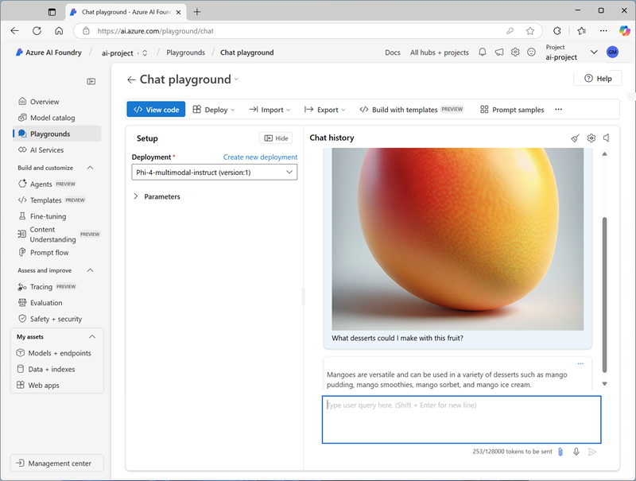

---
lab:
  title: 开发支持视觉的聊天应用
  description: 使用 Azure AI Foundry 生成支持图像输入的生成式 AI 应用。
---

# 开发支持视觉的聊天应用

在本练习中，你将使用 *Phi-4-multimodal-instruct* 生成式 AI 模型生成对包含图像的提示的响应。 你将开发一款应用，该应用使用 Azure AI Foundry 和 Azure AI 模型推理服务为杂货店中的新鲜农产品提供 AI 帮助。

> **注意**：本练习基于预发布版 SDK 软件，未来可能会有所变动。 必要时，我们使用了特定版本的包；这可能没有反映最新的可用版本。 可能会遇到一些意想不到的行为、警告或错误。

尽管本练习基于 Azure AI Foundry Python SDK，但你也可以使用多种语言特定的 SDK 开发 AI 聊天应用程序，包括：

- [适用于 Python 的 Azure AI 项目](https://pypi.org/project/azure-ai-projects)
- [适用于 Microsoft .NET 的 Azure AI 项目](https://www.nuget.org/packages/Azure.AI.Projects)
- [适用于 JavaScript 的 Azure AI 项目](https://www.npmjs.com/package/@azure/ai-projects)

此练习大约需要 **30** 分钟。

## 打开 Azure AI Foundry 门户

首先登录到 Azure AI Foundry 门户。

1. 在 Web 浏览器中打开 [Azure AI Foundry 门户](https://ai.azure.com)，网址为：`https://ai.azure.com`，然后使用 Azure 凭据登录。 关闭首次登录时打开的任何使用技巧或快速入门窗格，如有必要，使用左上角的 **Azure AI Foundry** 徽标导航到主页，类似下图所示（若已打开**帮助**面板，请关闭）：

    

1. 查看主页上的信息。

## 选择要启动项目的模型

Azure AI *项目*为 AI 开发提供协作工作区。 首先，选择要使用的模型并创建要在其中使用模型的项目。

> **备注**：AI Foundry 项目可以基于 *Azure AI Foundry* 资源，该资源提供对 AI 模型（包括 Azure OpenAI）、Azure AI 服务和其他资源的访问权限，用于开发 AI 代理和聊天解决方案。 或者，项目可以基于 *AI 中心*资源；其中包含与 Azure 资源的连接，用于安全存储、计算和专用工具。 基于 Azure AI Foundry 的项目非常适合想要管理 AI 代理或聊天应用开发的资源的开发人员。 基于 AI 中心的项目更适用于处理复杂 AI 解决方案的企业开发团队。

1. 在主页的“**浏览模型和功能**”部分中，搜索 `Phi-4-multimodal-instruct` 模型；我们将在项目中使用它。

1. 在搜索结果中，选择 Phi-4-multimodal-instruct**** 模型以查看其详细信息，然后在模型的页面顶部，选择“使用此模型”。****

1. 当提示创建项目时，输入项目的有效名称并展开“**高级选项**”。

1. 选择“**自定义**”并为中心指定以下设置：
    - **Azure AI Foundry 资源**：*Azure AI Foundry 资源的有效名称*
    - **订阅**：Azure 订阅
    - **资源组**：*创建或选择资源组*
    - **区域**：选择推荐的任何 AI Foundry******\*

    > \* 某些 Azure AI 资源受区域模型配额约束。 如果稍后在练习中达到配额限制，你可能需要在不同的区域中创建另一个资源。

1. 选择“创建”，并等待项目（包括所选的 Phi-4-multimodal-instruct 模型部署）创建。****

    > 注意:根据选择的模型，可能会在项目创建过程中收到其他提示。 同意条款并完成部署。

1. 创建项目后，模型将显示在“模型 + 终结点”页面中****：

    

## 在操场中测试模型

现在即可在聊天操场中使用基于图像的提示对多模式模型部署进行测试。

1. 在模型部署页面上，选择“在操场中打开”****。

1. 在新浏览器选项卡中，从`https://github.com/MicrosoftLearning/mslearn-ai-vision/raw/refs/heads/main/Labfiles/gen-ai-vision/mango.jpeg`下载 [mango.jpeg](https://github.com/MicrosoftLearning/mslearn-ai-vision/raw/refs/heads/main/Labfiles/gen-ai-vision/mango.jpeg) 并将其保存到本地文件系统上的文件夹。

1. 在“聊天操场”页的“**设置**”窗格中，确保已选择“**Phi-4-multimodal-instruct**”模型部署。

1. 在主“聊天会话”面板的“聊天输入”框下，使用附加按钮 (**&#128206;**) 上传 *mango.jpeg* 图像文件，然后添加文本`What desserts could I make with this fruit?`并提交提示。

    

1. 查看响应，希望此举可以为使用芒果制作甜点提供相关指导。

## 创建客户端应用程序

部署模型后，可以在客户端应用程序中使用部署。

### 准备应用程序配置

1. 在 Azure AI Foundry 门户中，查看项目的“**概述**”页。

1. 在“终结点和密钥”区域，确保已选中 Azure AI Foundry 库，并记下“Azure AI Foundry 项目终结点”************。 你将使用此连接字符串连接到客户端应用程序中的项目。

1. 打开新的浏览器选项卡（使 Azure AI Foundry 门户在现有选项卡中保持打开状态）。 然后在新选项卡中，浏览到 [Azure 门户](https://portal.azure.com)，网址为：`https://portal.azure.com`；如果出现提示，请使用 Azure 凭据登录。

    关闭任何欢迎通知以查看 Azure 门户主页。

1. 使用页面顶部搜索栏右侧的 **[\>_]** 按钮在 Azure 门户中新建 Cloud Shell，选择订阅中不含存储的 ***PowerShell*** 环境。

    在 Azure 门户底部的窗格中，Cloud Shell 提供命令行接口。 可以调整此窗格的大小或最大化此窗格，以便更易于使用。

    > **备注**：如果以前创建了使用 *Bash* 环境的 Cloud Shell，请将其切换到 ***PowerShell***。

    > **注意**：如果门户要求你选择存储来保存文件，请选择“不需要存储帐户”，选择正在使用的订阅，然后按“应用”。********

1. 在 Cloud Shell 工具栏的“**设置**”菜单中，选择“**转到经典版本**”（这是使用代码编辑器所必需的）。

    **<font color="red">在继续作之前，请确保已切换到 Cloud Shell 的经典版本。</font>**

1. 在 Cloud Shell 窗格中，输入以下命令以克隆包含此练习代码文件的 GitHub 存储库（键入命令，或将其复制到剪贴板后，在命令行中右键单击并粘贴为纯文本）：

    ```
    rm -r mslearn-ai-vision -f
    git clone https://github.com/MicrosoftLearning/mslearn-ai-vision
    ```

    > **提示**：将命令粘贴到 cloudshell 中时，输出可能会占用大量屏幕缓冲区。 可以通过输入 `cls` 命令来清除屏幕，以便更轻松地专注于每项任务。

1. 克隆存储库后，导航到包含应用程序代码文件的文件夹：  

    ```
   cd mslearn-ai-vision/Labfiles/gen-ai-vision/python
    ```

1. 在 Cloud Shell 命令行窗格中，输入以下命令安装将使用的库：

    ```
   python -m venv labenv
   ./labenv/bin/Activate.ps1
   pip install -r requirements.txt azure-identity azure-ai-projects openai
    ```

1. 输入以下命令以编辑已提供的配置文件：

    ```
   code .env
    ```

    该文件已在代码编辑器中打开。

1. 在代码文件中，将 your_project_endpoint 占位符替换为 Foundry 项目终结点（从 Azure AI Foundry 门户中的项目“概述”页复制），并将 your_model_deployment 占位符替换为分配给 Phi-4-multimodal-instruct 模型部署的名称。************

1. 替换占位符后，在代码编辑器中使用 “CTRL+S”**** 命令或“ 右键单击 > 保存”**** 保存更改，然后使用 “CTRL+Q”**** 命令或 “右键单击 > 退出”**** 关闭代码编辑器，同时保持 Cloud Shell 命令行打开。

### 写入代码以连接到项目并获取模型的聊天客户端

> **提示**：添加代码时，请务必保持正确的缩进。

1. 输入以下命令以编辑已提供的代码文件：

    ```
   code chat-app.py
    ```

1. 在代码文件中，请注意在文件顶部添加的现有语句，以导入必要的 SDK 命名空间。 然后，查找注释“**添加引用**”，添加以下代码以引用之前安装的库中的命名空间：

    ```python
   # Add references
   from azure.identity import DefaultAzureCredential
   from azure.ai.projects import AIProjectClient
   from openai import AzureOpenAI
    ```

1. 在 **main** 函数的注释“**获取配置设置**”下，请注意，代码将加载配置文件中定义的项目连接字符串和模型部署名称值。
1. 在 **main** 函数的注释“**获取配置设置**”下，请注意，代码将加载配置文件中定义的项目连接字符串和模型部署名称值。
1. 找到注释“初始化项目客户端”，添加以下代码，以连接到 Azure AI Foundry 项目****：

    > **提示**：注意保持代码的正确缩进级别。

    ```python
   # Initialize the project client
   project_client = AIProjectClient(            
            credential=DefaultAzureCredential(
                exclude_environment_credential=True,
                exclude_managed_identity_credential=True
            ),
            endpoint=project_endpoint,
        )
    ```

1. 查找注释“**获取聊天客户端**”，添加以下代码，以创建与模型聊天的客户端对象：

    ```python
   # Get a chat client
   openai_client = project_client.get_openai_client(api_version="2024-10-21")
    ```

### 写入代码以提交基于 URL 的图像提示

1. 请注意，代码包含一个循环，允许用户输入提示，直到输入“退出”。 然后在循环部分，查找注释“**获取对图像输入的响应**”，添加以下代码以提交包含以下图像的提示：

    

    ```python
   # Get a response to image input
   image_url = "https://github.com/MicrosoftLearning/mslearn-ai-vision/raw/refs/heads/main/Labfiles/gen-ai-vision/orange.jpeg"
   image_format = "jpeg"
   request = Request(image_url, headers={"User-Agent": "Mozilla/5.0"})
   image_data = base64.b64encode(urlopen(request).read()).decode("utf-8")
   data_url = f"data:image/{image_format};base64,{image_data}"

   response = openai_client.chat.completions.create(
        model=model_deployment,
        messages=[
            {"role": "system", "content": system_message},
            { "role": "user", "content": [  
                { "type": "text", "text": prompt},
                { "type": "image_url", "image_url": {"url": data_url}}
            ] } 
        ]
   )
   print(response.choices[0].message.content)
    ```

1. 使用 **Ctrl+S** 命令保存对代码文件的更改 - 请勿先关闭。

## 登录到 Azure 并运行应用

1. 在 Cloud Shell 命令行窗格中，输入以下命令以登录到 Azure。

    ```
   az login
    ```

    **<font color="red">必须登录到 Azure - 即使 Cloud Shell 会话已经过身份验证。</font>**

    > **备注**：在大多数情况下，仅使用 *az login* 就足够了。 但是，如果在多个租户中有订阅，则可能需要使用 *--tenant* 参数指定租户。 有关详细信息，请参阅[使用 Azure CLI 以交互方式登录到 Azure](https://learn.microsoft.com/cli/azure/authenticate-azure-cli-interactively)。
    
1. 出现提示时，请按照说明在新选项卡中打开登录页，并输入提供的验证码和 Azure 凭据。 然后在命令行中完成登录过程，并在出现提示时选择包含 Azure AI Foundry 中心的订阅。

1. 登录后，输入以下命令来运行应用程序：

    ```
   python chat-app.py
    ```

1. 出现提示时，输入以下提示：

    ```
   Suggest some recipes that include this fruit
    ```

1. 查看回应。 然后输入`quit`以退出程序。

### 修改代码以上传本地图像文件

1. 在应用代码的代码编辑器中，在循环部分中，查找之前在注释“**获取对图像输入的响应**”下添加的代码。 然后按如下所示修改代码，以上传此本地图像文件：

    

    ```python
   # Get a response to image input
   script_dir = Path(__file__).parent  # Get the directory of the script
   image_path = script_dir / 'mystery-fruit.jpeg'
   mime_type = "image/jpeg"

   # Read and encode the image file
   with open(image_path, "rb") as image_file:
        base64_encoded_data = base64.b64encode(image_file.read()).decode('utf-8')

   # Include the image file data in the prompt
   data_url = f"data:{mime_type};base64,{base64_encoded_data}"
   response = openai_client.chat.completions.create(
            model=model_deployment,
            messages=[
                {"role": "system", "content": system_message},
                { "role": "user", "content": [  
                    { "type": "text", "text": prompt},
                    { "type": "image_url", "image_url": {"url": data_url}}
                ] } 
            ]
   )
   print(response.choices[0].message.content)
    ```

1. 使用 **Ctrl+S** 命令保存对代码文件的更改。 还可以根据需要关闭代码编辑器 (**CTRL+Q**)。

1. 在代码编辑器下方的 Cloud Shell 命令行窗格中，输入以下命令以运行应用：

    ```
   python chat-app.py
    ```

1. 出现提示时，输入以下提示：

    ```
   What is this fruit? What recipes could I use it in?
    ```

15. 查看回应。 然后输入`quit`以退出程序。

    > **备注**：在此简单应用中，我们尚未实现用于保留对话历史记录的逻辑；因此模型会将每个提示视为一个新请求，且没有上一提示的上下文。

## 清理

如果已完成对 Azure AI Foundry 门户的探索，则应删除在本练习中创建的资源，以避免产生不必要的 Azure 成本。

1. 打开[Azure 门户](https://portal.azure.com)并查看在其中部署了本练习中使用的资源的资源组的内容。
1. 在工具栏中，选择“删除资源组”****。
1. 输入资源组名称，并确认要删除该资源组。
